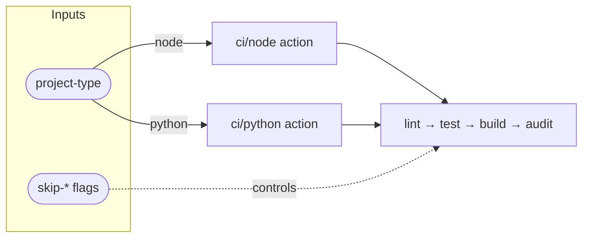

# CI Workflow Flow

::caption::
`project-type` input determines which CI action runs; `skip-*` flags control individual steps

<!--
The workflow dispatches to either ci/node or ci/python based on project-type—one interface, two implementations. This branching happens early so each ecosystem gets optimized tooling like npm versus uv without complicating the caller's config. Now let's see how the PR workflow extends this by adding commit linting.
-->
