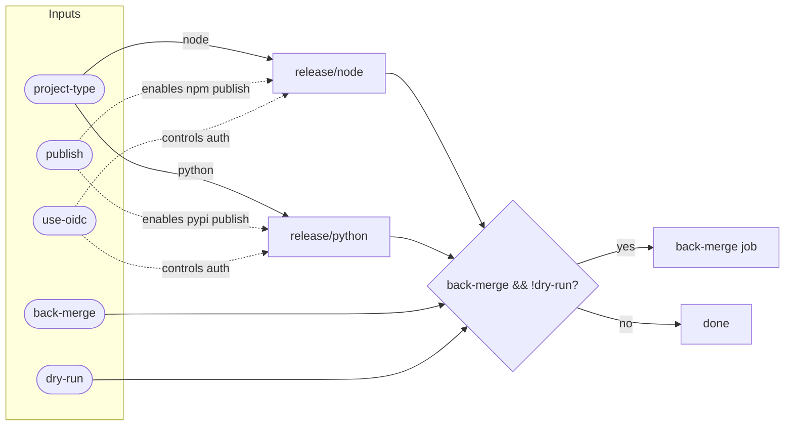

# Release Workflow Flow

::caption::
`publish` enables atomic npm/pypi publishing based on project-type; `use-oidc` controls auth

<!--
The publish flag enables atomic registry publishing and OIDC controls authentication. Back-merge only runs on real releases, not dry-runs. The dry-run option lets you preview what would happen without side effects—useful for testing release configuration changes. Here's what the actual consumer workflow looks like; notice how simple it is.
-->
