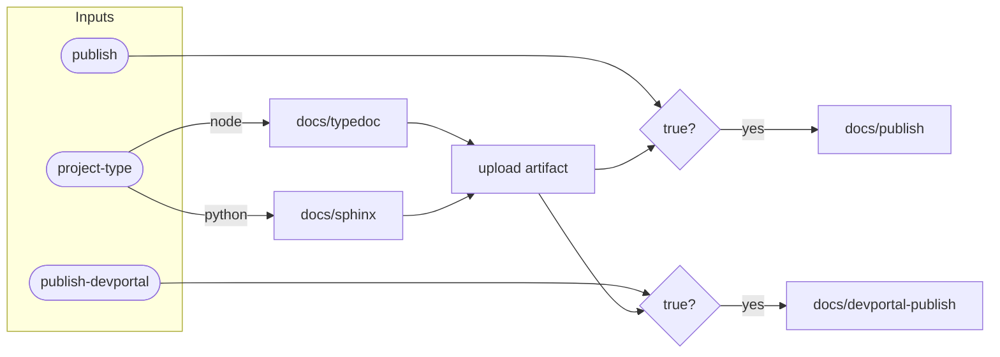

# Docs Workflow Flow

::caption::
GitHub Pages and DevPortal publishing are independent and controlled by inputs

<!--
GitHub Pages and DevPortal publishing run independently—you can enable either or both. The artifact step ensures docs are built once and deployed many times. This decoupling makes it easy to add new targets later. Finally, let's cover the standalone publish workflow for recovery scenarios.
-->
