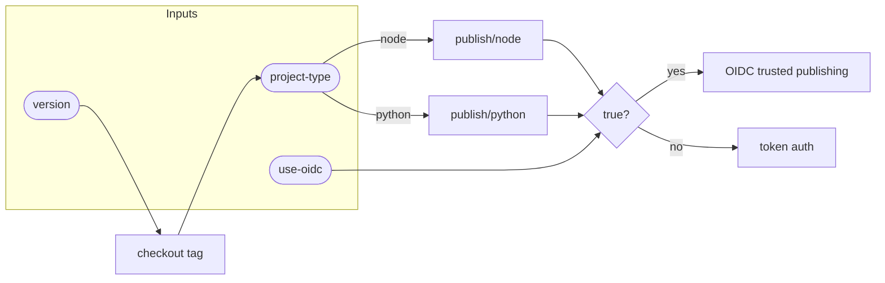

# Standalone Publish Workflow Flow

::caption::
`use-oidc` input controls authentication method; OIDC eliminates long-lived secrets

<!--
Checkout happens by Git tag, not branch—this ensures you publish exactly what was released. OIDC is preferred over long-lived tokens since it eliminates secret rotation headaches. Both npm and PyPI support it now, so there's no reason to use tokens for new projects. That covers the workflows layer. Now let's dive into the composite actions that implement all this.
-->
